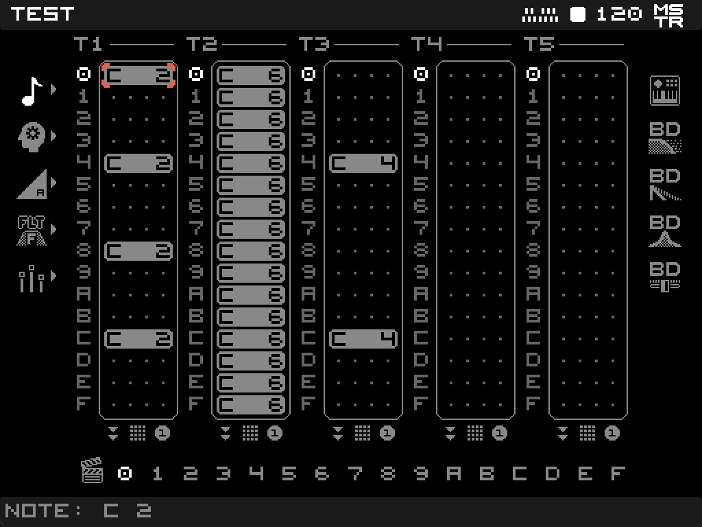

# BRIXEQ: TrimUI Brick PAK

A handheld groovebox and step sequencer for the TrimUI Brick. Five tracks, sixteen patterns per track, sixteen scenes per project, with per-step snapshots of the whole instrument so every step can sound completely different from the next.

## Install

Available via **PAK Store** on NextUI. Connect your TrimUI Brick to Wi-Fi, open PAK Store from the Tools menu, and install BRIXEQ.

## User Data

Projects and recordings are stored on the SD card:

```
/mnt/SDCARD/Tools/tg5040/BRIXEQ.pak/
├── PROJECTS/      saved .brixeq project files
└── RECORDINGS/    WAV bounces of the master bus
```

These folders survive PAK updates.

## Manual Installation

If for whatever reason you do not have the PAK Store:

1. Download the latest release from this repo.
2. Unzip the release download.
3. Copy the `BRIXEQ.pak` folder to `SD_ROOT/Tools/tg5040`.
4. Reinsert your SD Card into your device.
5. Launch BRIXEQ from the Tools menu.

## Manual

The full feature reference and gesture guide lives in [MANUAL.md](MANUAL.md). It is also reachable in-app via the SELECT menu's HELP entry.

## Screenshots


